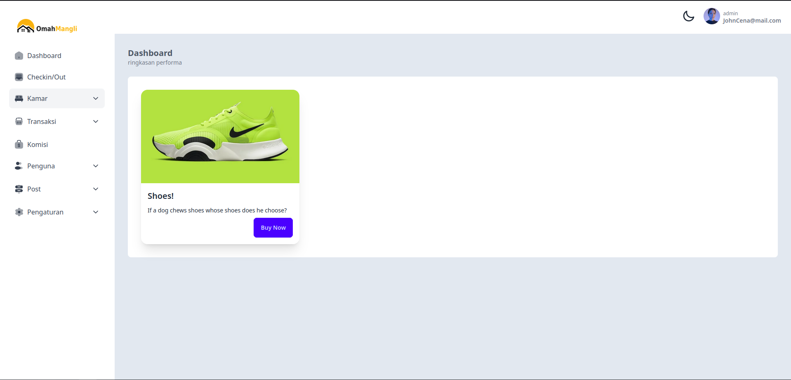

<p align="center">
  <a href="" rel="noopener">
 </a>
</p>

<h3 align="center">Tailwind React Dashboard</h3>

<div align="center">

[]()
[](https://github.com/kylelobo/The-Documentation-Compendium/issues)
[](https://github.com/kylelobo/The-Documentation-Compendium/pulls)
[](/LICENSE)

</div>

---

<p align="center"> Few lines describing your project.
    <br> 
</p>

## 📝 ScreenShoot


## 📝 Table of Contents

- [About](#about)
- [Getting Started](#getting_started)
- [Built Using](#built_using)
- [Authors](#authors)

## 🧐 About <a name = "about"></a>

generating this project , dashboar boilerplate for react

## 🏁 Getting Started <a name = "getting_started"></a>

These instructions will get you a copy of the project up and running on your local machine for development and testing purposes. See [deployment](#deployment) for notes on how to deploy the project on a live system.

### Prerequisites

What things you need to install the software and how to install them.


- **Node.js**: You need Node.js installed on your machine. You can download it from [here](https://nodejs.org/).
- **npm or yarn**: Node package manager (npm) is installed with Node.js. Alternatively, you can use yarn. You can install yarn from [here](https://yarnpkg.com/).


### Installing

A step by step series of examples that tell you how to get a development env running.

Say what the step will be

```
npm install
```


```
npm run build
```


## ⛏️ Built Using <a name = "built_using"></a>

- [React](https://www.react.com/) - Web Framework
- [Tailwind](https://tailwind.com/) - Css Framework
- [DaisyUi](https://daisyui.com/) - Component Utitity Framework

## ✍️ Authors <a name = "authors"></a>

- [@izzelislam](https://github.com/pakkor) - Idea & Initial work

